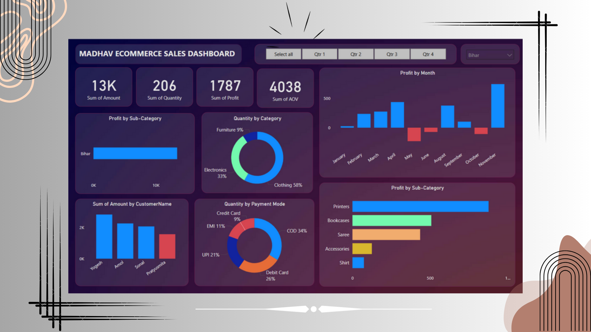

<h2 align="center">
  Interactive Online Sales Dashboard<br/>
  <a>Madhav Store</a>
</h2>

<div align="center">
  
</div>

<br/>

<div align="center">

[](https://forthebadge.com) &nbsp;
[](https://forthebadge.com) &nbsp;

</div>

<h3 align="center">
    🔹
    <a href="https://github.com/your-username/online-sales-dashboard/issues">Report Bug</a> &nbsp; &nbsp;
    🔹
    <a href="https://github.com/your-username/online-sales-dashboard/issues">Request Feature</a>
</h3>

---

## TL;DR

This project is an interactive Power BI dashboard designed for Madhav Store to analyze online sales data. The dashboard provides actionable insights into sales performance, customer behavior, and regional trends across India. 

You can access the files and code in this repository. Please give proper credit by linking back to [your GitHub profile](https://github.com/your-username). Thanks!

---

## Built With

This project was created using the following technologies and tools:

- **Power BI** for data visualization and dashboard creation
- **DAX** for custom calculations like Average Order Value (AOV)
- **Power Query** for data transformation and cleaning
- **CSV Files** as the data source

---

## Features

✨ **Interactive Dashboard Design** with slicers and filters  
📊 **Key Visualizations** include bar charts, pie charts, and trend lines  
📈 **Insights** on sales, profit, and customer behavior  
💡 **Custom DAX Calculations** to compute Average Order Value (AOV)  

---

## Dataset

Two CSV files were used in this project:  

1. **Details.csv**  
   - Contains transactional data with columns: `Order ID`, `Amount`, `Profit`, `Quantity`, `Category`, `Sub-Category`, `Payment Mode`, and `AOV`.  
2. **Orders.csv**  
   - Includes order details with columns: `Order ID`, `Customer Name`, `State`, `Date`, etc.

---

## Visualizations

1. **Cards:**  
   - Total Sales Amount  
   - Total Profit  
   - Total Quantity Sold  
   - Average Order Value  

2. **Stacked Bar and Column Charts:**  
   - Amount by State  
   - Profit by Sub-Category  
   - Amount by Customer Name  
   - Profit Trends by Month  

3. **Donut Pie Charts:**  
   - Quantity by Category  
   - Quantity by Payment Mode  

4. **Filters and Slicers:**  
   - State  
   - Product Category  
   - Payment Mode  
   - Date Range  

---

## Key Insights

- **Top States:** Maharashtra and Karnataka lead in sales revenue.  
- **High-Profit Sub-Categories:** Focus on these for business growth.  
- **Preferred Payment Modes:** Digital payments dominate, but cash on delivery is still relevant.  
- **Customer Loyalty:** A small group of customers contributes significantly to revenue.  

---

## Getting Started

1. Clone the repository:
   ```bash
   git clone https://github.com/your-username/online-sales-dashboard.git
   ```

2. Open the Power BI (.pbix) file in [Power BI Desktop](https://powerbi.microsoft.com/desktop/).

3. Connect to the provided CSV files (`Details.csv` and `Orders.csv`) in the data source settings.

4. Explore the dashboard and interact with the visualizations.

---

### Show your support

Give a ⭐ if you find this project helpful!  

[](https://www.buymeacoffee.com/gbraad)
